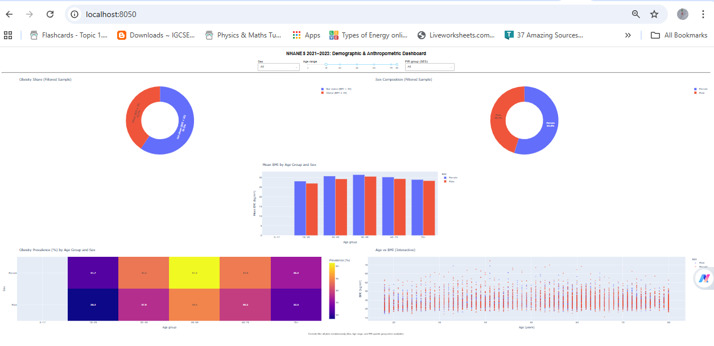

# NHANES Anthropometric Data Visualization

[](https://doi.org/10.20944/preprints202601.1809.v1)
[](https://creativecommons.org/licenses/by/4.0/)

## Overview

This repository contains the complete code and visualizations for the preprint:

**"Visual Exploration of Anthropometric Patterns in NHANES 2021–2023"**  
DOI: [10.20944/preprints202601.1809.v1](https://doi.org/10.20944/preprints202601.1809.v1)

The project analyzes Body Mass Index (BMI) and obesity prevalence using data from the National Health and Nutrition Examination Survey (NHANES) 2021–2023, focusing on patterns across age, sex, and socioeconomic status (Poverty-Income Ratio).

## Repository Contents

| File | Description |
|------|-------------|
| `nhanes_analysis.ipynb` | Jupyter notebook with full data loading, cleaning, EDA, and static figure generation |
| `app.py` | Interactive Dash dashboard for dynamic exploration |
| `requirements.txt` | Python package dependencies |
| `Figure_1_BMI_Distribution.png` | BMI Distribution by Sex (KDE) |
| `Figure_2_Age_vs_BMI.png` | Age vs BMI Scatter with LOWESS Trend |
| `Figure_3_Obesity_Heatmap.png` | Obesity Prevalence Heatmap (Age × Sex) |
| `Figure_4_BMI_vs_PIR.png` | BMI vs Socioeconomic Status (PIR Quartiles) |

## Interactive Dashboard

The Dash dashboard allows users to dynamically filter data by:
- **Sex** (Male / Female / All)
- **Age range** (slider)
- **SES (PIR quartiles)**

All five visualizations update simultaneously:
- Obesity share (donut chart)
- Sex composition (donut chart)
- Mean BMI by age group and sex (bar chart)
- Obesity prevalence heatmap
- Age vs BMI scatter plot

### Running the Dashboard Locally

```bash
# Clone the repository
git clone https://github.com/saamurrii/nhanes-anthropometric-viz.git
cd nhanes-anthropometric-viz

# Install dependencies
pip install -r requirements.txt

# Run the Dash app
python app.py
